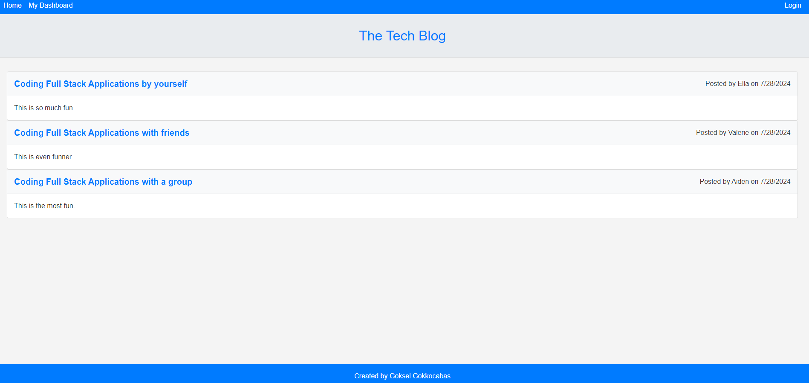
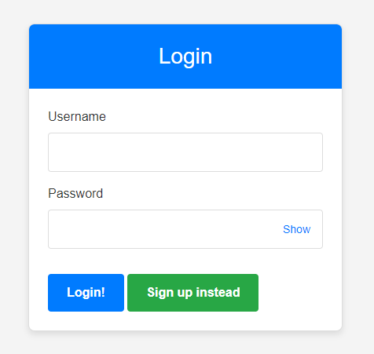
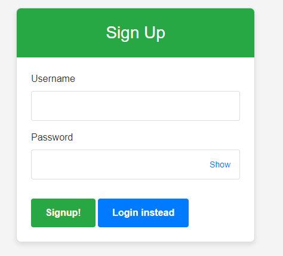
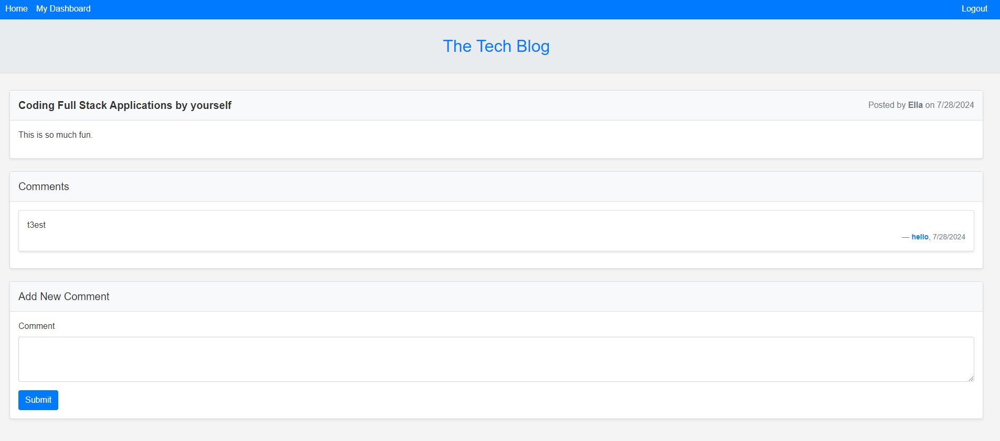
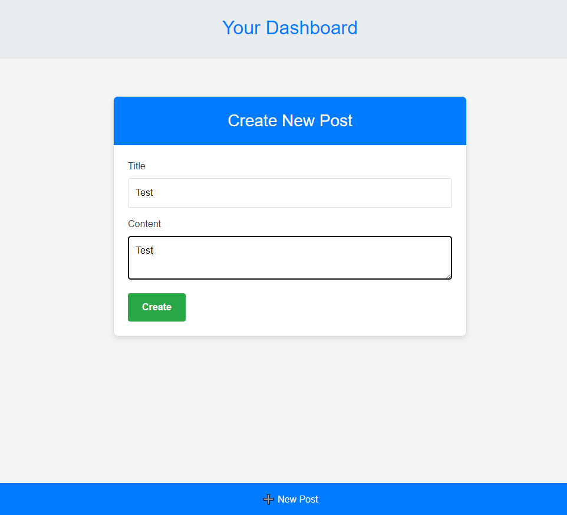
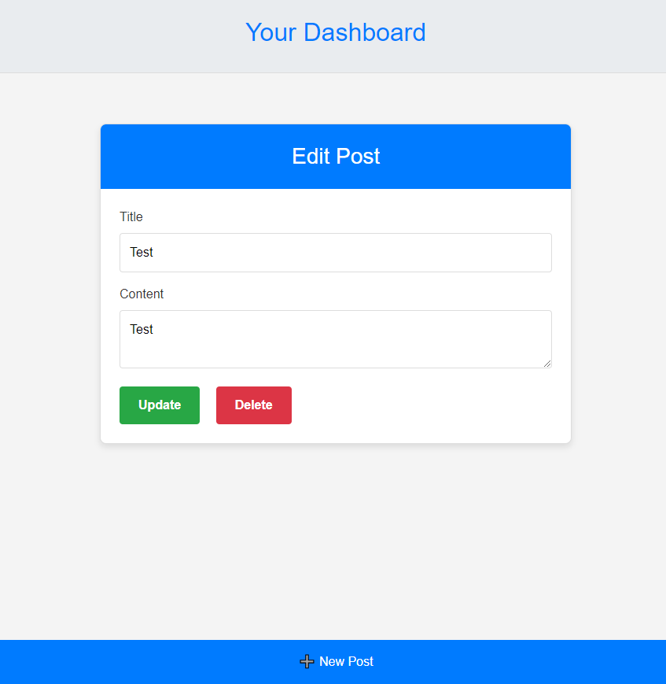
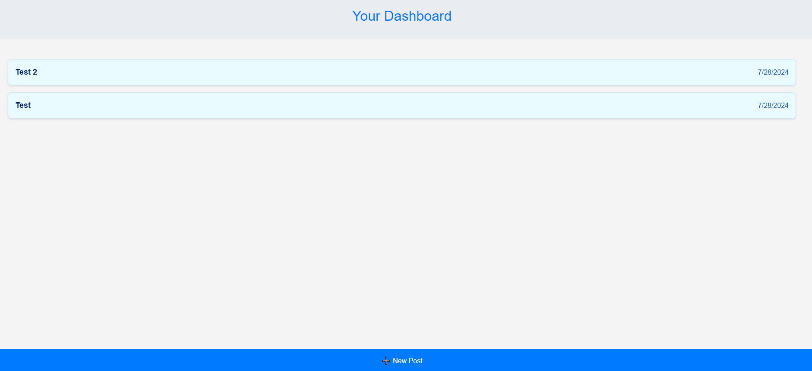

Title: Tech-Blog-MVC

Description:
In this challenge, I have created a Full-Stack website where users can blog about anything they want. I have used handlebars to serve the front end and express server for the backend. I have used custom css styling as well as Bootstrap and Google Fonts.  
How to Run:
Please click on deployed link below and you will be prompted to the main page of the application. You can view the example blogs that were created or you can write your own. In order to do that, you will have to sign up. Once you sign up, you will automatically be logged in. You can create a new post, edit your posts or delete them entirely, you can also leave a comment for any of the posts while logged in.

Github Repository : https://github.com/wilsacker/Crypto-Currently
Deployed Link : https://crypto-currently.onrender.com/